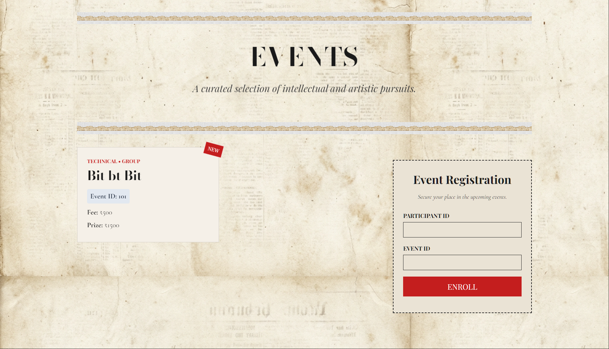
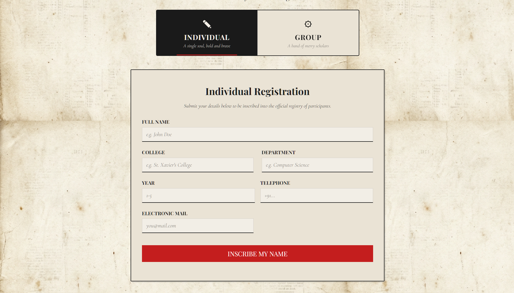
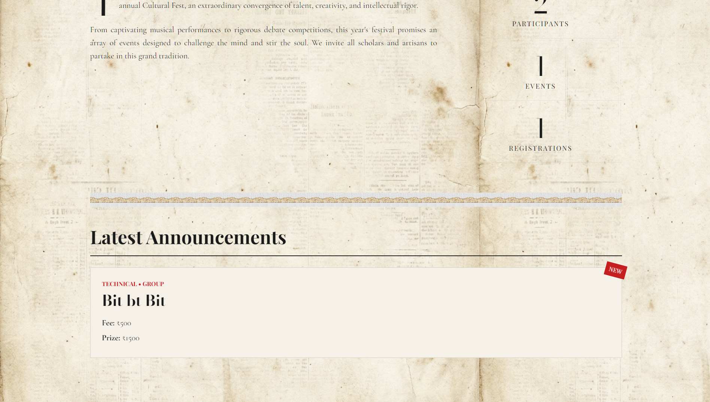
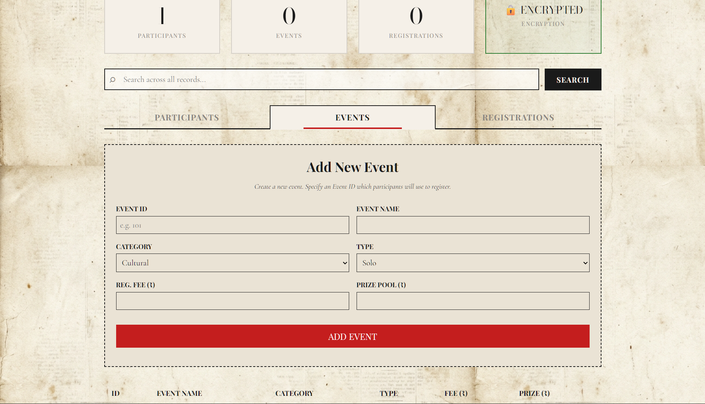
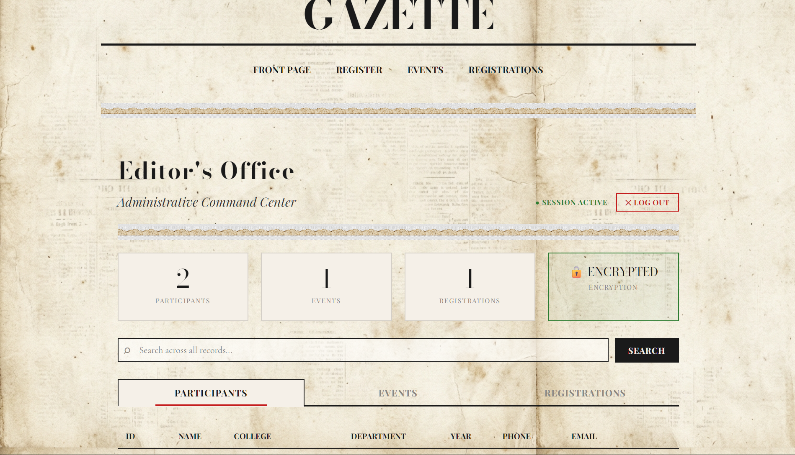

# Cultural Fest Registration Platform

A FastAPI and MySQL-based web application for managing cultural fest registrations, featuring an encrypted database, secure admin panel, and an aesthetic newspaper-themed frontend with PARALLAX EFFECT.

## Demo & Previews

<div align="center">
  
  <br/>
  <em>Homepage - The Cultural Fest Gazette</em>
</div>
<br/>

<div align="center">
  
  <br/>
  <em>Events and Event Registration</em>
</div>
<br/>

<div align="center">
  
  <br/>
  <em>Individual Registration Form</em>
</div>
<br/>

<div align="center">
  
  <br/>
  <em>Latest Announcements Section</em>
</div>
<br/>

<div align="center">
  
  <br/>
  <em>Admin Panel - Add New Event</em>
</div>
<br/>

<div align="center">
  
  <br/>
  <em>Admin Panel - Editor's Office</em>
</div>

## Features
- **Frontend**: Newspaper-themed dynamic interface with GPU-accelerated parallax scrolling.
- **Backend**: FastAPI for high-performance async routing.
- **Security**: Field-level AES encryption using Fernet for sensitive participant data. Secure session-based Admin Dashboard.
- **Database**: MySQL schema for participants, events, and registrations.

## Local Development Setup

1. **Install Dependencies:**
   ```bash
   pip install -r requirements.txt
   ```

2. **Database Setup:**
   - Ensure you have MySQL running.
   - Create a database named `cultural_fest` (or your preferred name).
   - Import the database schema:
     ```bash
     mysql -u root -p cultural_fest < schema.sql
     ```

3. **Environment Variables:**
   - Copy `.env.example` to `.env` and fill in your database credentials and an encryption key.
   - Generate a secure encryption key using Python:
     ```python
     from cryptography.fernet import Fernet; print(Fernet.generate_key().decode())
     ```

4. **Run the Application:**
   ```bash
   python aston.py
   ```
   Alternatively, you can run uvicorn directly: `uvicorn aston:app --reload`

## Deployment (Render + PlanetScale)

### 1. PlanetScale Database Setup
1. Create a database on PlanetScale.
2. Get the connection credentials (host, username, password). PlanetScale requires SSL.
3. Import the `schema.sql` into your PlanetScale database using their CLI or console.

### 2. Render Deployment
1. Connect your GitHub repository to Render and create a new **Web Service**.
2. **Build Command**: `pip install -r requirements.txt`
3. **Start Command**: Use the provided `Procfile` or explicitly set: `uvicorn aston:app --host 0.0.0.0 --port $PORT`
4. **Environment Variables**:
   Add the following variables in the Render dashboard:
   - `DB_HOST`: Your PlanetScale host (e.g., `aws.connect.psdb.cloud`)
   - `DB_USER`: Your PlanetScale username
   - `DB_PASSWORD`: Your PlanetScale password
   - `DB_NAME`: Your PlanetScale database name
   - `DB_SSL`: `true` (This tells the app to enable SSL for the MySQL connection)
   - `ENCRYPTION_KEY`: A secure 32-url-safe-base64-encoded key (generated as shown above). **Do not lose this key, or your data will be permanently unreadable.**
   - `ENVIRONMENT`: `production`

The application will automatically bind to the port provided by Render and use SSL to connect to PlanetScale.
